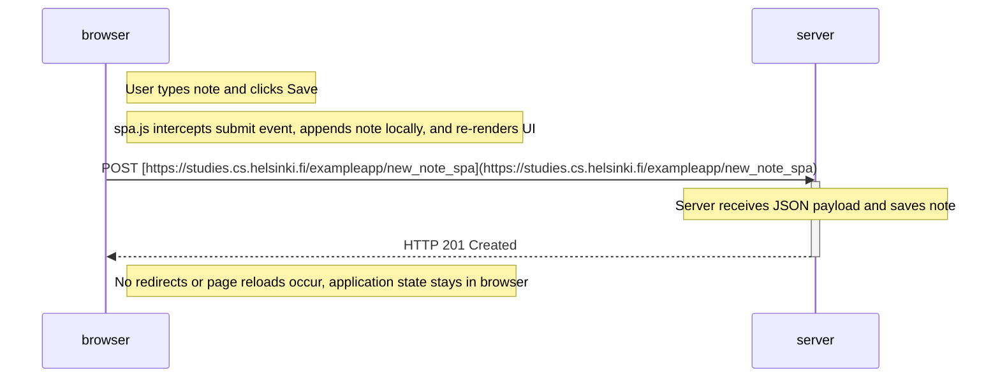

```mermaid
sequenceDiagram
    participant browser
    participant server

    Note right of browser: User types note and clicks Save
    Note right of browser: spa.js intercepts submit event, appends note locally, and re-renders UI

    browser->>server: POST [https://studies.cs.helsinki.fi/exampleapp/new_note_spa](https://studies.cs.helsinki.fi/exampleapp/new_note_spa)
    activate server
    Note over server: Server receives JSON payload and saves note
    server-->>browser: HTTP 201 Created
    deactivate server

    Note right of browser: No redirects or page reloads occur, application state stays in browser
```
